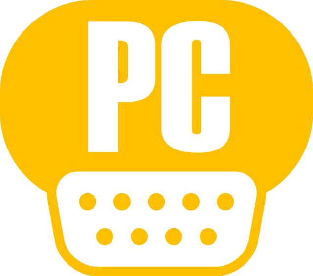
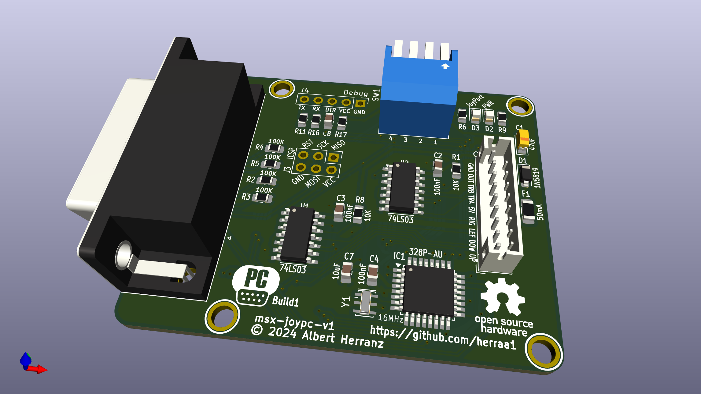
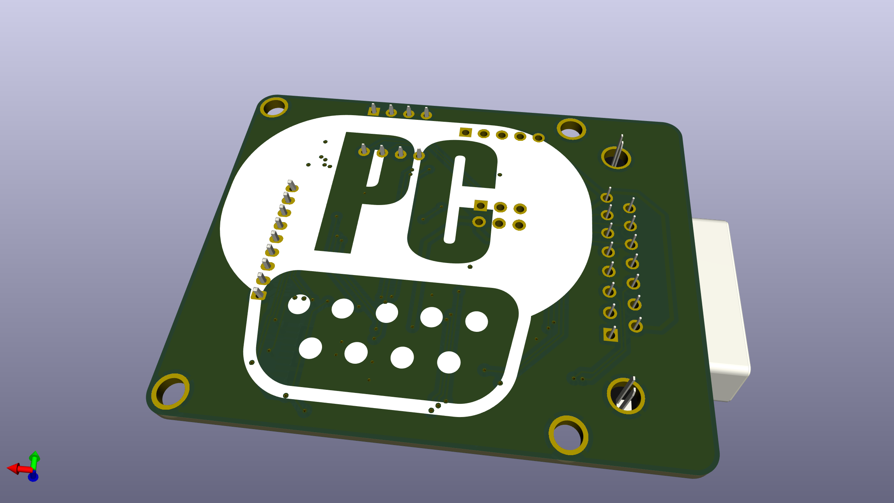
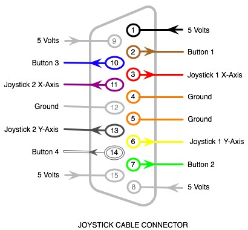

# PC gameport joystick controller adapter for MSX (msx-joypc) v1

Connect [PC gameport joysticks](https://en.wikipedia.org/wiki/Game_port) to [MSX computers](https://www.msx.org/wiki/).

> [!WARNING]
> This is a work in progress project.
>
> No tested boards yet, just an initial breadboarding.
>
> No build instructions are yet provided.
>
> Build at your own risk.
>

## Introduction

The msx-joypc v1 is an adapter that allows connecting PC gameport joysticks to [MSX general purpose I/O ports](https://www.msx.org/wiki/General_Purpose_port).

The main features of the msx-joypc v1 adapter are:
* small footprint
* made of widely available electronic components
* behaves as a cord extension between the MSX computer and the PC gameport joystick
* uses a female standard DE9 connector on the adapter's MSX joystick side
* uses a [DA-15](https://en.wikipedia.org/wiki/D-subminiature) socket on the adapter's PC gameport joystick side
* no need for external power supply, the adapter draws current from the MSX port
* low power consumption (<20mA)
* serial debug provides information about the operation of the adapter

## [Hardware](hardware/kicad/)

The msx-joypc v1 adapter uses an [Atmega328p](https://en.wikipedia.org/wiki/ATmega328) to convert the [PC gameport joystick signalling](https://www.epanorama.net/documents/joystick/pc_joystick.html) to the [MSX joystick standard signalling](https://www.msx.org/wiki/Joystick_control).

A two-sided printed circuit board (PCB) is used to put together all components:
* An Atmega328p as the main MCU, running at 5V 16MHz
* Two 74LS03 quad 2-input NAND gates with open collectors to completely mimic the standard MSX joystick behavior
* A PTC fuse to minimize damage to the MSX computer in case something goes wrong with the board
* Several additional required components (crystal, diode, leds, resistors, ceramic capacitors and a tantalum capacitor)
* An angled DA-15 socket is used to directly connect the PC gameport joystick
* A PH2.0 connector is used to connect the MSX cable extension
* A 2.54 pitch debug header is added for serial debug and programming
* An ICSP header is provided for burning a bootloader or to flash the chip using a hardware programmer
* A DIP switch to configure the adapter for compatibility with different PC joysticks

Connection to the MSX general purpose I/O port is implemented using a DE9 joystick extension cable with a female DE9 connector on one side and a loose end on the other side.
The MSX joystick extension cable loose end is wired according to the following pinout mapping.

|  |
|:--|
| MSX joystick connector pinout, from controller plug side |

| MSX side pin | Cable color (may vary) | Signal |
| ------------ | ---------------------- | ------ |
| 5            | Brown                  | +5v    |
| 4            | Orange                 | RIGHT  |
| 3            | Grey                   | LEFT   |
| 2            | Black                  | DOWN   |
| 1            | Red                    | UP     |
| 6            | Green                  | TRIGA  |
| 7            | White                  | TRIGB  |
| 8            | Blue                   | OUT    |
| 9            | Yellow                 | GND    |

The msx-joypc v1 is fully compatible with MSX joysticks and honors the pin8 (OUT) signal.

The adapter uses open collector outputs (using 74LS03 Quad 2-Input NAND gates with open collector outputs) which makes the adapter safer [^2] than the
standard MSX joystick schematic depicted in the MSX Technical Data Book, as it avoids a series of undesired conditions that can lead to bus contention/short circuits.

Power is drawn from the +5V signal of the MSX general purpose I/O port, which is capable of delivering up to 50mA [^1].
The msx-joypc v1 draws below 20mA from the port when a controller is connected, so it is on the safe side. Anyway, the msx-joypc adapter uses a Positive Temperature Coeficient (PTC) resettable fuse of 50mA (F1) to limit current in case something goes wrong.

Also on the power side, a [1N5819 Schottky diode](https://www.diodes.com/assets/Datasheets/1N5819HW.pdf) (D1) is used to avoid leaking current from the msx-joypc adapter to the MSX in case power is applied to one of the VCC pins available on the ICSP or Debug headers while the adapter is plugged into an MSX.

Connection to the PC gameport joystick is done via a PC gameport joystick socket.

|  |
|:--|
| Gameport connector pinout, from PC gameport joystick side |

| Gameport pin   | Signal       | Comment                                                                   |
| -------------- | -------------| ------------------------------------------------------------------------- |
| 1              | +5V          | +5V power                                                                 |
| 2              | B1           | Button1                                                                   |
| 3              | X1           | Joystick 1 - X axis                                                       |
| 4              | GND          | ground                                                                    |
| 5              | GND          | ground                                                                    |
| 6              | Y1           | Joystick 1 - Y axis                                                       |
| 7              | B2           | Button2                                                                   |
| 8              | +5V          | +5V power                                                                 |
| 9              | +5V          | +5V power                                                                 |
| 10             | B3           | Button3                                                                   |
| 11             | X2           | Joystick 2 - X axis                                                       |
| 12             | GND/MIDI_OUT | ground / MIDI out                                                         |
| 13             | Y2           | Joystick 2 - Y axis                                                       |
| 14             | B4           | Button4                                                                   |
| 15             | +5V/MIDI_IN  | +5V power / MIDI_IN                                                       |

The PC gameport joystick uses 5V for power and logic.

Power for the PC gameport joystick is provided by the MSX +5V rail.

### [Build1](hardware/kicad/msx-joypc-v1-build1)

[Bill Of Materials (BoM)](https://html-preview.github.io/?url=https://raw.githubusercontent.com/herraa1/msx-joypc-v1/main/hardware/kicad/msx-joypc-v1-build1/bom/ibom.html)

This is the first build of the adapter.

> [!WARNING]
> Board prototypes for this build have been ordered, but not built yet.
>
> Build at your own risk.
>

## [Firmware](firmware/msx-joypc-v1/)

The msx-joypc v1 adapter firmware uses a slightly modified version of [Necroware's GamePort adapter firmware](https://github.com/necroware/gameport-adapter) to read the PC gameport joystick status.

The following elements are used as inputs:
* joystick X and Y axis as direction arrows
* button 1, as Trigger 1
* button 2, as Trigger 2

Those elements' status are processed by the msx-joypc firmware and transformed into MSX general purpose I/O port's signals on the fly.

## [Enclosure](enclosure/)

### Acrylic

A simple acrylic enclosure design for the project is provided to protect the electronic components and provide strain relief for the extension cords.

> [!WARNING]
> Enclosure has not yet been tested.
>
> Build at your own risk.
>

The enclosure uses a 3mm acrylic sheet.

## References

MSX general purpose I/O port
* https://www.msx.org/wiki/General_Purpose_port

Atmega328p pinout
- https://camo.githubusercontent.com/06bc0a6bb71729956af107f56c3e57bd065d9fb924bcc7f6bb8fbb487a1a5e55/68747470733a2f2f692e696d6775722e636f6d2f6e6177657145362e6a7067

Joystick PC Gameport pinout
* https://allpinouts.org/pinouts/connectors/input_device/joystick-pc-gameport/

PC joystick interface
* https://www.epanorama.net/documents/joystick/pc_joystick.html

Necroware's GamePort adapter project
* https://github.com/necroware/gameport-adapter

Using a PC Joystick with the Arduino
* http://www.built-to-spec.com/blog/2009/09/10/using-a-pc-joystick-with-the-arduino/

Arduino gameport interface
* https://build-its.blogspot.com/2012/01/arduino-game-port-interface.html

DIY gameport to USB adapter
* https://littlebigtech.net/posts/diy-gameport-to-usb-adapter/

## Image Sources

* https://www.oshwa.org/open-source-hardware-logo/
* https://en.wikipedia.org/wiki/File:Numbered_DE9_Diagram.svg

[^1]: https://www.msx.org/wiki/General_Purpose_port
[^2]: https://www.msx.org/wiki/Joystick/joypad_controller (see "Undesired Conditions")

